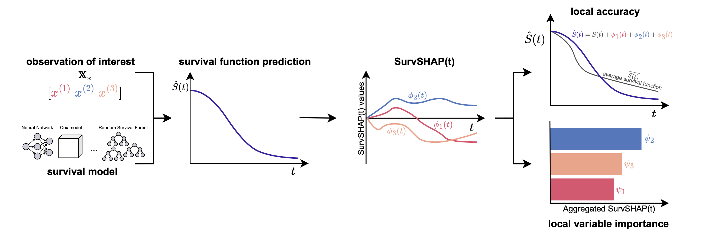

# SurvSHAP(t)

This repository contains data and code for the article:

M. Krzyziński, M. Spytek, H. Baniecki, P. Biecek. ***SurvSHAP(t): Time-dependent explanations of machine learning survival models***. https://arxiv.org/abs/2208.11080.

Python version: 3.10.5

### Methods 
- `survshap` directory contains the SurvSHAP(t) method implementation (NOTE: it can be installed as package - `setup.py`) 
- `survlime.py` is the [SurvLIME](https://www.sciencedirect.com/science/article/abs/pii/S0950705120304044) method implementation
- `survnam` directory contains the [SurvNAM](https://www.sciencedirect.com/science/article/abs/pii/S0893608021004949) method implementation (based on [Jia-Xiang Chengh implementation](https://github.com/jiaxiang-cheng/PyTorch-SurvNAM))

### Data
- `data_generation.R` is the code for synthetic censored data generation (for Experiments 1 and 2)
- `data` directory contains the datasets used in experiments

### Experiments
- `*.ipynb` are notebooks with code of the conducted experiments 
- `results` directory contains results of the conducted experiments

### Plots
- `plots.R` is the code for creating Figures from the article
- `plots` directory contains Figures in `.pdf` format
